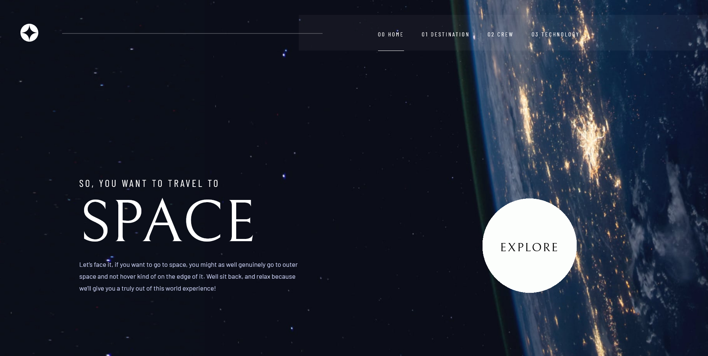

# Frontend Mentor - Space tourism website solution

This is a solution to the [Space tourism website challenge on Frontend Mentor](https://www.frontendmentor.io/challenges/space-tourism-multipage-website-gRWj1URZ3).

## Table of contents

- [Overview](#overview)
  - [The challenge](#the-challenge)
  - [Screenshot](#screenshot)
  - [Links](#links)
- [My process](#my-process)
  - [Built with](#built-with)
  - [What I learned](#what-i-learned)
  - [Continued development](#continued-development)
  - [Useful resources](#useful-resources)
- [Author](#author)
- [Acknowledgments](#acknowledgments)

## Overview

### The challenge

- View the optimal layout for each of the website's pages depending on their device's screen size
- See hover states for all interactive elements on the page
- View each page and be able to toggle between the tabs to see new information

### Screenshot



### Links

- Solution URL: [https://github.com/Soaphub/Space-project-react]
- Live Site URL: [https://soaphub.github.io/Space-project-react/#/home]

## My process

### Built with

- Semantic HTML5 markup
- CSS custom properties
- Bootstrap- css framework
- Mobile-first workflow
- [React](https://reactjs.org/) - JS library
- [Styled Components](https://styled-components.com/) - For styles

### What I learned
```css
#homepage {
  background-color: #0B0D17;
  background-image: url("../assets/home/left.jpg"), url("../assets/home/background-home-desktop.jpg");
  background-position: left, right;
  background-size: 550px 1000px, 1500px 1000px;
  background-repeat: no-repeat, no-repeat;
}
```
```js
const[hamBurger, setCLose] = useState(true);
  const[navEdit, setEdit] = useState(true);

  function togglenav(){
    setCLose((prevalue)=>!prevalue);
    setEdit((prevalue)=>!prevalue);
  }

  useEffect(()=>{
    if(props.click === "show"){
      togglenav();
    }
  },[props], [hamBurger],[navEdit]);
```

### Continued development

I have added event listener for the explore in mobile view for responsive website.


### Useful resources

- [https://www.youtube.com/c/TheNetNinja] - This helped me for React router. 

## Author

- Website - [Ambadi](https://soaphub.github.io/Space-project-react/#/home)

- Frontend Mentor - [@Soaphub](https://www.frontendmentor.io/profile/Soaphub)

## Acknowledgments

The udemdy coarse by Angela helped a lot in completing the project.

